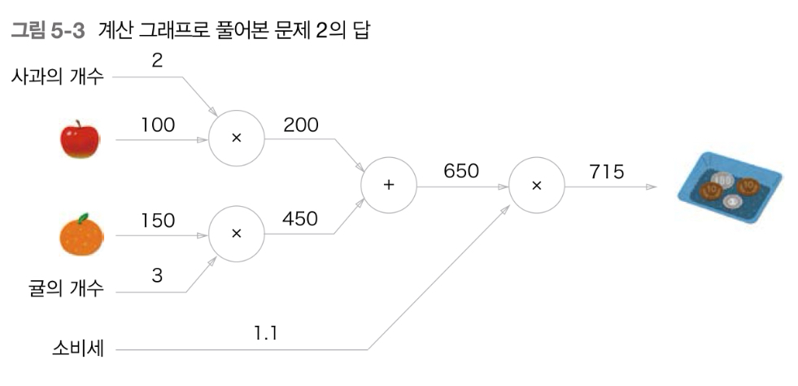

# 오차역전파법

## Computational graph

-   계산 그래프는 노드와 에지로 표현된다.
    

-   계산 그래프를 이용한 문제풀이는 다음 흐름과 같다.

1. 계산 그래프 구성
2. 그래프에서 계산을 왼쪽에서 오른쪽으로 진행

-   이때 계산을 왼쪽에서 오른쪽으로 진행하는 단계를 순전파(forward propagation)라고 한다.
-   반대로 오른쪽에서 왼쪽으로 전파는 역전파(backward propagation)라고 한다.
-   계산 그래프는 국소적 계산에 집중한다.
-   각 노드는 자신의 계산만 하면 된다.
-   그렇게 함으로써 전체를 구성하는 복잡한 계산을 해낼 수 있다. 이게 핵심
-   딥러닝에 적용하면 역전파를 통해 미분을 효율적으로 계산할 수 있음

## 역전파 계산 핵심

-   변화율은 곧 미분이다.
-   `dz`의 변화는 `dz`의 미분이다.
-   변화는 다른 값에 의해 발생한다. (`dz`는 종속적임.)
-   `z = f(x+y)`의 경우 `x`와 `y`에 대해 `z`가 변화한다.
-   즉, `x`와 `y`에 대한 `z`의 미분이다.
-   순전파 방향에서 '~에 대한'에 위치한 변수가 아래에 오고 노드 뒤에 출력으로 나오는 변수가 위에 온다.
